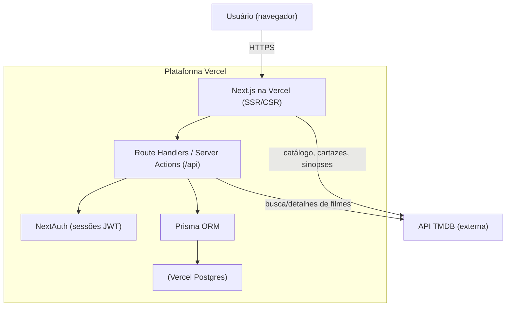

# 🛠️ ReelRate — Especificação Técnica (Design Doc)

> Documento técnico que descreve **como** o ReelRate será construído.
> Complementa o **[PRD](./PRD_ReelRate.md)**, que define **o quê** e **por quê**.

| | |
|---|---|
| **Versão** | 1.0 |
| **Data** | Junho de 2026 |
| **Status** | Aprovado para implementação |
| **Documento de produto** | [PRD_ReelRate.md](./PRD_ReelRate.md) |

---

## Sumário

1. [Objetivo e Escopo do Documento](#1-objetivo-e-escopo-do-documento)
2. [Visão Geral da Arquitetura](#2-visão-geral-da-arquitetura)
3. [Stack Técnica](#3-stack-técnica)
4. [Decisões Arquiteturais (ADRs)](#4-decisões-arquiteturais-adrs)
5. [Modelo de Dados](#5-modelo-de-dados)
6. [Autenticação e Segurança](#6-autenticação-e-segurança)
7. [Integração com a TMDB](#7-integração-com-a-tmdb)
8. [API Interna e Contratos](#8-api-interna-e-contratos)
9. [Estrutura de Pastas](#9-estrutura-de-pastas)
10. [Infraestrutura e Deploy](#10-infraestrutura-e-deploy)
11. [Escalabilidade e Desempenho](#11-escalabilidade-e-desempenho)
12. [Observabilidade e Tratamento de Erros](#12-observabilidade-e-tratamento-de-erros)
13. [Estratégia de Testes](#13-estratégia-de-testes)
14. [Variáveis de Ambiente](#14-variáveis-de-ambiente)
15. [Riscos Técnicos e Mitigações](#15-riscos-técnicos-e-mitigações)

---

## 1. Objetivo e Escopo do Documento

Este Design Doc traduz os requisitos do **[PRD](./PRD_ReelRate.md)** em decisões de
implementação. Ele orienta o desenvolvimento (inclusive com apoio de ferramentas de IA),
serve de referência para revisão técnica e registra **o porquê** de cada escolha.

**Princípio norteador:** simplicidade e plataforma única. A equipe decidiu manter toda a
aplicação — front-end, back-end e banco de dados — dentro do ecossistema **Vercel**, sem
serviços externos de banco, priorizando entrega rápida, baixo custo e facilidade de
evolução, sem abrir mão da capacidade de escalar.

O que **não** está neste documento: definição de problema, personas, funcionalidades de
produto e métricas de sucesso — tudo isso vive no PRD.

---

## 2. Visão Geral da Arquitetura

O ReelRate é uma aplicação **full-stack monolítica em Next.js** (App Router), executada de
forma **serverless** na Vercel. O front-end (React Server/Client Components) e o back-end
(Route Handlers e Server Actions) coexistem no mesmo projeto. A persistência usa
**Vercel Postgres** via **Prisma**, e o catálogo de filmes vem da **API TMDB**.



**Responsabilidades por camada**

| Camada | Responsabilidade |
|---|---|
| UI (React/Next.js) | Renderização das telas, formulários e estados de carregamento/erro |
| Route Handlers / Server Actions | Regras de negócio, validação, orquestração de dados |
| NextAuth | Autenticação por credenciais e emissão/validação de sessão (JWT) |
| Prisma | Acesso tipado ao banco e migrações |
| Vercel Postgres | Persistência de usuários e avaliações |
| TMDB | Fonte do catálogo de filmes (não persistido) |

---

## 3. Stack Técnica

| Camada | Tecnologia | Papel |
|---|---|---|
| Framework (front + back) | **Next.js (App Router) + TypeScript** | Renderização, rotas, UI e API no mesmo projeto |
| Estilização | **Tailwind CSS** | Sistema de estilos utilitário e responsivo |
| Estado / dados (cliente) | **TanStack Query** | Cache, sincronização e gestão de requisições |
| Requisições HTTP | **fetch / Axios** | Cliente para a API TMDB e endpoints internos |
| Autenticação | **NextAuth (Auth.js)** | Login por e-mail e senha, sessões via JWT |
| Hash de senha | **bcrypt** | Armazenamento seguro de credenciais |
| Validação | **Zod** | Validação de payloads de entrada (server-side) |
| ORM | **Prisma** | Modelagem, acesso ao banco e migrações |
| Banco de dados | **Vercel Postgres** | Persistência de usuários e avaliações |
| Catálogo externo | **API TMDB** | Filmes, cartazes, sinopses e metadados |
| Hospedagem | **Vercel** | Deploy, execução serverless e banco de dados |

> Versionamento: fixar as versões maiores no `package.json` e usar TypeScript em modo
> `strict` para reduzir erros em tempo de build.

---

## 4. Decisões Arquiteturais (ADRs)

### ADR-01 — Plataforma única (Vercel) e app monolítico em Next.js

- **Contexto:** equipe pequena, prazo curto, escopo enxuto.
- **Decisão:** front-end, API (Route Handlers/Server Actions) e banco no mesmo projeto Vercel.
- **Alternativas consideradas:** back-end separado (ex.: API em Node dedicada) + front desacoplado.
- **Consequências:** menos peças móveis, deploy único e simples; em contrapartida, acoplamento
  maior entre front e back (aceitável neste escopo).

### ADR-02 — Vercel Postgres no lugar do Supabase

- **Contexto:** evitar depender de um serviço externo de banco.
- **Decisão:** usar **Vercel Postgres** (Postgres serverless provisionado no próprio projeto Vercel).
- **Alternativas consideradas:** Supabase, Neon avulso, SQLite/Turso.
- **Consequências:** banco dentro da mesma plataforma, sem conta externa; mantém Postgres +
  Prisma (migração trivial a partir de um Postgres anterior); escala sob demanda. Atenção ao
  uso de **pooling de conexões** no ambiente serverless.

### ADR-03 — Autenticação por credenciais (sem provedores externos)

- **Contexto:** simplicidade e zero dependência de OAuth de terceiros.
- **Decisão:** **NextAuth** com Credentials Provider (e-mail + senha) e **sessões JWT** (stateless).
- **Alternativas consideradas:** login com Google/GitHub (OAuth), sessões em banco.
- **Consequências:** menos configuração e sem dependência externa; a equipe assume a
  responsabilidade de armazenar senhas com hash (**bcrypt**) e tratar recuperação de senha
  como evolução futura (ver Roadmap no PRD).

### ADR-04 — Catálogo de filmes via TMDB (não persistido)

- **Contexto:** não faz sentido manter manualmente uma base de filmes.
- **Decisão:** consumir a TMDB em tempo de execução e **referenciar cada filme pelo seu ID** da TMDB.
- **Consequências:** catálogo sempre atualizado e banco enxuto; cria dependência de
  disponibilidade/limites da TMDB (mitigada com cache — ver §7 e §11).

### ADR-05 — Domínio reduzido a Usuário e Avaliação

- **Contexto:** escopo de produto sem camada social nem listas.
- **Decisão:** modelar apenas **Usuário** e **Avaliação**.
- **Consequências:** schema e código simples; espaço para crescer (seguir usuários, listas)
  fica documentado como evolução futura, sem custo agora.

---

## 5. Modelo de Dados

Com o escopo enxuto, o domínio se reduz a duas entidades próprias (**Usuário** e
**Avaliação**), além da referência ao filme da TMDB (apenas o ID é persistido).

### 5.1. Entidades

| Entidade | Descrição | Principais relações |
|---|---|---|
| **User** | Conta com nome, e-mail, senha (hash) e avatar | Possui várias avaliações (1:N) |
| **Review** | Nota (1–5) e comentário sobre um filme | Pertence a um usuário; referencia um filme da TMDB por ID |

> O **filme** não é uma tabela: é referenciado por `tmdbMovieId`. Título, cartaz e sinopse
> são obtidos da TMDB em tempo de execução.

### 5.2. Schema Prisma (proposto)

```prisma
generator client {
  provider = "prisma-client-js"
}

datasource db {
  provider = "postgresql"
  url      = env("POSTGRES_PRISMA_URL")       // pooling (serverless)
  directUrl = env("POSTGRES_URL_NON_POOLING") // migrações
}

model User {
  id        String   @id @default(cuid())
  name      String
  email     String   @unique
  password  String                     // hash bcrypt
  avatarUrl String?
  reviews   Review[]
  createdAt DateTime @default(now())
  updatedAt DateTime @updatedAt
}

model Review {
  id          String   @id @default(cuid())
  rating      Int                        // 1..5 (validado na aplicação)
  comment     String?
  tmdbMovieId Int                        // referência ao filme na TMDB
  user        User     @relation(fields: [userId], references: [id], onDelete: Cascade)
  userId      String
  createdAt   DateTime @default(now())
  updatedAt   DateTime @updatedAt

  @@unique([userId, tmdbMovieId])        // RN-01: uma avaliação por filme por usuário
  @@index([tmdbMovieId])                 // RN-05: agregação de nota média por filme
}
```

### 5.3. Restrições mapeadas às regras de negócio (PRD §5.1)

| Regra (PRD) | Como é garantida tecnicamente |
|---|---|
| RN-01 — uma avaliação por filme | Índice único `@@unique([userId, tmdbMovieId])` |
| RN-02 — nota de 1 a 5 | Validação com Zod no servidor (`rating: z.number().int().min(1).max(5)`) |
| RN-03 — avaliação exige autenticação | Sessão NextAuth obrigatória no Route Handler |
| RN-04 — propriedade da avaliação | Comparar `review.userId` com o ID da sessão antes de editar/excluir |
| RN-05 — cálculo da nota média | Agregação `AVG(rating)` por `tmdbMovieId` |

---

## 6. Autenticação e Segurança

- **Provedor:** NextAuth com **Credentials Provider** (e-mail + senha).
- **Sessão:** estratégia **JWT** (stateless), adequada ao modelo serverless — sem necessidade
  de armazenar sessão em banco. Cookie de sessão `httpOnly`, `secure` e `sameSite=lax`.
- **Senhas:** nunca em texto puro. Hash com **bcrypt** (custo ≥ 10) no cadastro; comparação
  no login.
- **Autorização:** Route Handlers que alteram dados verificam a sessão e, quando aplicável, a
  **propriedade** do recurso (RN-04).
- **Validação de entrada:** todo payload é validado com **Zod** no servidor antes de tocar o banco.
- **Segredos:** chaves (TMDB, `NEXTAUTH_SECRET`, URLs do banco) **somente** em variáveis de
  ambiente — nunca versionadas.
- **LGPD:** coletar o mínimo (nome, e-mail); permitir exclusão de conta como evolução.

---

## 7. Integração com a TMDB

- **Uso:** lançamentos (home), busca, detalhes do filme (cartaz, sinopse, metadados).
- **Referência por ID:** a aplicação guarda apenas `tmdbMovieId`; o restante é buscado on-demand.
- **Chamadas no servidor:** as requisições à TMDB são feitas **no servidor** (Route Handlers /
  Server Components), mantendo a API key fora do cliente.
- **Cache:** usar cache do Next.js (`fetch` com `revalidate`) para dados estáveis (detalhes do
  filme) e janelas curtas para listas que mudam (lançamentos). No cliente, **TanStack Query**
  evita refetch desnecessário.
- **Resiliência:** tratar `429` (rate limit) e indisponibilidade com rettry/backoff simples e
  estados de erro amigáveis na UI; nunca quebrar a página inteira por falha da TMDB.

**Endpoints TMDB previstos (referência):**

| Necessidade | Endpoint TMDB |
|---|---|
| Lançamentos | `GET /movie/now_playing` |
| Busca | `GET /search/movie` |
| Detalhes do filme | `GET /movie/{movie_id}` |

---

## 8. API Interna e Contratos

API implementada como **Route Handlers** (`app/api/...`) e/ou **Server Actions**. Todas as
rotas que modificam dados exigem sessão válida.

| Método | Rota | Descrição | Auth | Regras |
|---|---|---|---|---|
| `POST` | `/api/auth/register` | Cria conta (nome, e-mail, senha) | — | E-mail único; hash de senha |
| `POST` | `/api/auth/[...nextauth]` | Login/logout (NextAuth) | — | Credentials |
| `GET` | `/api/movies/now-playing` | Lista lançamentos (proxy TMDB) | — | Cache |
| `GET` | `/api/movies/search?q=` | Busca filmes (proxy TMDB) | — | Cache |
| `GET` | `/api/movies/:tmdbId` | Detalhes + nota média + avaliações | — | RN-05 |
| `POST` | `/api/movies/:tmdbId/reviews` | Cria avaliação (nota + comentário) | ✅ | RN-01, RN-02, RN-03 |
| `PATCH` | `/api/reviews/:id` | Edita avaliação | ✅ | RN-02, RN-04 |
| `DELETE` | `/api/reviews/:id` | Exclui avaliação | ✅ | RN-04 |
| `GET` | `/api/users/me/reviews` | Histórico de avaliações do usuário | ✅ | — |
| `PATCH` | `/api/users/me` | Atualiza perfil (avatar) | ✅ | — |

**Convenções:** respostas em JSON; erros com status HTTP adequado (`400` validação, `401`
não autenticado, `403` sem permissão, `404` não encontrado, `429` limite TMDB). Corpo de erro
padronizado: `{ "error": { "code": string, "message": string } }`.

---

## 9. Estrutura de Pastas

Organização sugerida com Next.js App Router:

```
reelrate/
├─ app/
│  ├─ (auth)/login/page.tsx
│  ├─ (auth)/register/page.tsx
│  ├─ page.tsx                  # Home (lançamentos)
│  ├─ movies/[tmdbId]/page.tsx  # Página do filme
│  ├─ profile/page.tsx          # Perfil + histórico
│  └─ api/
│     ├─ auth/[...nextauth]/route.ts
│     ├─ movies/...             # proxies TMDB + avaliações
│     └─ reviews/[id]/route.ts
├─ components/                  # UI reutilizável
├─ lib/
│  ├─ prisma.ts                 # singleton do Prisma
│  ├─ auth.ts                   # config do NextAuth
│  ├─ tmdb.ts                   # cliente da TMDB
│  └─ validations.ts            # schemas Zod
├─ prisma/
│  └─ schema.prisma
├─ public/
├─ .env.local                  # não versionado
└─ package.json
```

> **Singleton do Prisma:** em ambiente serverless, instanciar o Prisma como singleton global
> para evitar esgotar conexões a cada invocação.

---

## 10. Infraestrutura e Deploy

- **Hospedagem:** Vercel (CI/CD integrado ao GitHub; cada push gera *Preview Deployment*,
  merge na branch principal vai para produção).
- **Banco:** **Vercel Postgres** provisionado no próprio projeto; as variáveis de conexão são
  injetadas automaticamente pela Vercel.
- **Migrações:** `prisma migrate deploy` no passo de build/deploy; desenvolvimento local com
  `prisma migrate dev`. Usar `POSTGRES_URL_NON_POOLING` para migrações e
  `POSTGRES_PRISMA_URL` (pooling) em runtime.
- **Ambientes:** `Production`, `Preview` e `Development`, cada um com seu conjunto de variáveis.
- **Build:** `next build`; gerar o Prisma Client (`prisma generate`) no `postinstall`.

---

## 11. Escalabilidade e Desempenho

A arquitetura simples **não** impede escala:

- **Compute:** funções serverless da Vercel **autoescalam** por requisição.
- **Banco:** **pooling de conexões** do Vercel Postgres é compatível com o modelo serverless
  (evita o problema de "connection storm").
- **Sessão:** **stateless (JWT)** — qualquer instância valida a sessão sem estado compartilhado.
- **Catálogo:** servido pela TMDB e por **cache**, tirando carga do banco.
- **Leitura quente:** cache do Next.js (`revalidate`/ISR) para detalhes de filme; agregação de
  nota média indexada por `tmdbMovieId`.

Gargalo provável em escala: agregações de nota média sob alta carga — mitigável com cache da
média e, se necessário, materialização (contagem/soma incremental) no futuro.

---

## 12. Observabilidade e Tratamento de Erros

- **Logs:** logs estruturados nas Route Handlers; usar Vercel Logs/Analytics.
- **Erros de UI:** `error.tsx`/`loading.tsx` do App Router para estados de erro e carregamento.
- **Falhas externas (TMDB):** degradação graciosa — mostrar mensagem e permitir retry, sem
  derrubar a página.
- **Validação:** mensagens de erro claras a partir do Zod.

---

## 13. Estratégia de Testes

| Nível | Foco | Ferramenta sugerida |
|---|---|---|
| Unitário | Regras de negócio e validações (Zod, cálculo de média) | Vitest/Jest |
| Integração | Route Handlers + Prisma (banco de teste) | Vitest + Prisma |
| E2E (essencial) | Fluxos críticos: cadastro, login, avaliar filme | Playwright |

Prioridade mínima para o MVP: testes dos fluxos críticos (cadastro/login e criar avaliação)
e das regras RN-01/RN-02/RN-04.

---

## 14. Variáveis de Ambiente

| Variável | Descrição |
|---|---|
| `POSTGRES_PRISMA_URL` | Conexão do Postgres com **pooling** (runtime) |
| `POSTGRES_URL_NON_POOLING` | Conexão direta para **migrações** |
| `NEXTAUTH_SECRET` | Segredo para assinar/validar o JWT da sessão |
| `NEXTAUTH_URL` | URL base da aplicação (ambiente) |
| `TMDB_API_KEY` | Chave de acesso à API TMDB (apenas no servidor) |
| `TMDB_BASE_URL` | URL base da TMDB (opcional, padrão configurável) |

> Nenhuma dessas variáveis deve ser versionada. Em produção/preview, são configuradas no
> painel da Vercel; localmente, em `.env.local`.

---

## 15. Riscos Técnicos e Mitigações

| Risco | Impacto | Mitigação |
|---|---|---|
| Indisponibilidade/limite da TMDB | Catálogo indisponível | Cache, retry/backoff, degradação graciosa |
| Esgotamento de conexões no serverless | Erros intermitentes de banco | Pooling (`POSTGRES_PRISMA_URL`) + singleton do Prisma |
| Senhas e segredos vazados | Segurança | bcrypt, segredos só em env, revisão de PRs |
| Inconsistência de nota média sob carga | Dados/Performance | Índice por `tmdbMovieId` + cache; materializar se necessário |
| Conteúdo abusivo nos comentários | Moderação/Produto | Política de moderação e ferramentas (evolução) |

---

> Este Design Doc registra as decisões técnicas acordadas pela equipe para a implementação do
> ReelRate. Ele evolui junto com o projeto; mudanças relevantes de arquitetura devem ser
> refletidas aqui e, quando afetarem produto, no [PRD](./PRD_ReelRate.md).
