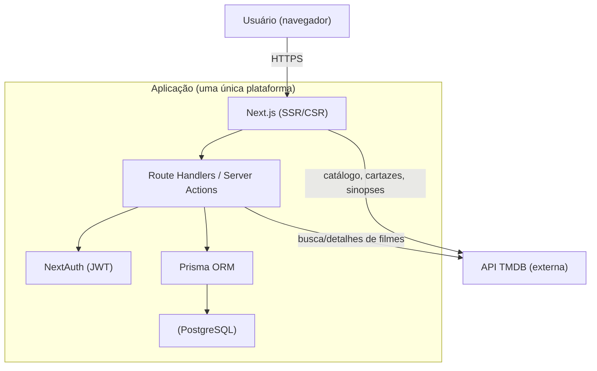

<div align="center">

# ReelRate

**Plataforma web de avaliação de filmes integrada à API TMDB.**

Avalie filmes com nota e comentário e descubra a opinião agregada da comunidade.


</div>

---

## Sumário

- [Sobre o projeto](#sobre-o-projeto)
- [Funcionalidades](#funcionalidades)
- [Tecnologias](#tecnologias)
- [Arquitetura](#arquitetura)
- [Estrutura de pastas](#estrutura-de-pastas)
- [Modelo de dados e regras de negócio](#modelo-de-dados-e-regras-de-negócio)
- [Como rodar localmente](#como-rodar-localmente)
- [Variáveis de ambiente](#variáveis-de-ambiente)
- [Scripts disponíveis](#scripts-disponíveis)
- [Documentação](#documentação)
- [Contribuição](#contribuição)
- [Roadmap](#roadmap)
- [Equipe](#equipe)

---

## Sobre o projeto

O **ReelRate** é uma aplicação web voltada a amantes do cinema que combina um catálogo amplo
de filmes com avaliações da comunidade. Os usuários exploram lançamentos, abrem a página de
cada título e registram suas opiniões com nota e comentário, formando uma referência coletiva
sobre cada filme.

O catálogo é alimentado pela API pública da **TMDB** (The Movie Database), garantindo uma base
ampla e atualizada de títulos, sinopses, cartazes e metadados — sem que o produto precise
manter esse conteúdo manualmente.

O projeto é deliberadamente **enxuto e focado**: o valor central está em avaliar filmes de
forma simples e consultar a opinião agregada da comunidade. A arquitetura roda inteiramente
em uma única plataforma, priorizando entrega rápida, baixo custo e facilidade de evolução,
sem abrir mão da capacidade de escalar.

> Visão completa de produto no **[PRD](./PRD_ReelRate.md)** e as decisões técnicas na
> **[Especificação Técnica](./DESIGN_DOC.md)**.

---

## Funcionalidades

Escopo do MVP (foco no essencial):

- **Conta de usuário** — cadastro e login com e-mail e senha.
- **Home de lançamentos** — filmes recém-lançados, atualizados via TMDB.
- **Busca de filmes** — localizar títulos no catálogo.
- **Página do filme** — cartaz, sinopse, nota média e comentários da comunidade.
- **Avaliações** — atribuir nota (1–5) e comentário; editar e excluir as próprias.
- **Perfil** — histórico das próprias avaliações.

### Status do desenvolvimento

| Etapa | Status |
|---|---|
| Fundação técnica (Next.js, Prisma, NextAuth, TMDB, banco) | Concluída |
| Autenticação (cadastro/login) | Em desenvolvimento |
| Catálogo (home, busca, página do filme) | Em desenvolvimento |
| Avaliações e perfil | Em desenvolvimento |
| Deploy (Vercel) | Planejado |

---

## Tecnologias

| Camada | Tecnologia |
|---|---|
| Framework (front + back) | **Next.js 14** (App Router) + **TypeScript** |
| Estilização | **Tailwind CSS 3** |
| Autenticação | **NextAuth v4** (Credentials + sessão JWT) + **bcryptjs** |
| ORM | **Prisma 5** |
| Banco de dados | **PostgreSQL 16** (Docker em dev · Vercel Postgres em produção) |
| Validação | **Zod** |
| Catálogo externo | **API TMDB** |
| Hospedagem (planejada) | **Vercel** |

---

## Arquitetura

Aplicação **full-stack monolítica** em Next.js: front-end (React Server/Client Components) e
back-end (Route Handlers / Server Actions) no mesmo projeto. Persistência em PostgreSQL via
Prisma; catálogo consumido da TMDB no servidor (sem persistir o catálogo — cada filme é
referenciado pelo seu ID na TMDB).



Detalhes (decisões, contratos de API, deploy e escalabilidade) na
**[Especificação Técnica](./DESIGN_DOC.md)**.

---

## Estrutura de pastas

```
gabryel-filmes/
├─ app/                          # Rotas e UI (App Router)
│  ├─ api/auth/[...nextauth]/    # Handler do NextAuth
│  ├─ layout.tsx
│  └─ page.tsx                   # Landing
├─ lib/
│  ├─ prisma.ts                  # Singleton do Prisma
│  ├─ auth.ts                    # Configuração do NextAuth (authOptions)
│  ├─ tmdb.ts                    # Cliente da API TMDB (server-only)
│  └─ validations.ts             # Schemas Zod (login, cadastro, avaliação)
├─ prisma/
│  ├─ schema.prisma              # Modelos User e Review
│  └─ migrations/                # Migrações versionadas
├─ types/
│  └─ next-auth.d.ts             # Augmentation: id do usuário na sessão
├─ docker-compose.yml            # PostgreSQL local
├─ .env.example                  # Modelo de variáveis de ambiente
├─ PRD_ReelRate.md               # Documento de produto
├─ DESIGN_DOC.md                 # Especificação técnica
└─ CONTRIBUTING.md               # Guia de contribuição
```

---

## Modelo de dados e regras de negócio

Domínio reduzido a duas entidades próprias; o filme é externo (referenciado por `tmdbMovieId`).

| Entidade | Descrição |
|---|---|
| **User** | Conta com nome, e-mail, senha (hash) e avatar. Possui várias avaliações. |
| **Review** | Nota (1–5) e comentário sobre um filme. Pertence a um usuário; referencia um filme da TMDB. |

**Regras de negócio garantidas:**

- **RN-01** — Uma avaliação por filme por usuário (índice único `userId + tmdbMovieId`).
- **RN-02** — Nota inteira entre 1 e 5 (validação Zod).
- **RN-03** — Apenas usuários autenticados criam/editam/excluem avaliações.
- **RN-04** — Cada usuário só altera as próprias avaliações.
- **RN-05** — Nota média do filme calculada a partir de todas as avaliações.

---

## Como rodar localmente

### Pré-requisitos

- **Node.js** 18+
- **Docker** e **Docker Compose** (para o PostgreSQL local)

### Passo a passo

```bash
# 1. Instalar dependências
npm install

# 2. Configurar variáveis de ambiente
#    Copie o modelo para os dois arquivos de ambiente:
#      .env        -> usado pela CLI do Prisma
#      .env.local  -> usado pelo runtime do Next.js
cp .env.example .env
cp .env.example .env.local
#    Em seguida preencha NEXTAUTH_SECRET e TMDB_API_KEY (veja a seção abaixo).
#    Gere um secret:
#      node -e "console.log(require('crypto').randomBytes(32).toString('base64'))"

# 3. Subir o banco de dados (PostgreSQL em container; porta 5433 no host)
npm run db:up

# 4. Aplicar as migrações (cria as tabelas)
npx prisma migrate dev

# 5. Iniciar a aplicação
npm run dev
```

A aplicação ficará disponível em **http://localhost:3000**.

> O banco roda em container na porta **5433** do host (a 5432 é evitada para não conflitar
> com instalações nativas do PostgreSQL). Ajuste as URLs no `.env`/`.env.local` se necessário.

---

## Variáveis de ambiente

| Variável | Descrição | Onde |
|---|---|---|
| `POSTGRES_PRISMA_URL` | Conexão do Postgres (pooling em produção) | `.env` e `.env.local` |
| `POSTGRES_URL_NON_POOLING` | Conexão direta, usada nas migrações | `.env` e `.env.local` |
| `NEXTAUTH_SECRET` | Segredo para assinar/validar o JWT da sessão | `.env.local` |
| `NEXTAUTH_URL` | URL base da aplicação (ex.: `http://localhost:3000`) | `.env.local` |
| `TMDB_API_KEY` | Chave **v3** da TMDB (apenas no servidor) | `.env.local` |
| `TMDB_BASE_URL` | URL base da TMDB (`https://api.themoviedb.org/3`) | `.env.local` |

> `.env` e `.env.local` **não são versionados**. Obtenha sua chave TMDB em
> [themoviedb.org/settings/api](https://www.themoviedb.org/settings/api). Em produção, as
> variáveis são configuradas no painel da Vercel.

---

## Scripts disponíveis

| Script | Ação |
|---|---|
| `npm run dev` | Servidor de desenvolvimento |
| `npm run build` | Build de produção |
| `npm run start` | Inicia o build de produção |
| `npm run lint` | Lint (ESLint) |
| `npm run db:up` | Sobe o PostgreSQL (Docker) |
| `npm run db:down` | Derruba o PostgreSQL (Docker) |
| `npm run prisma:migrate` | Cria/aplica migrações |
| `npm run prisma:studio` | Abre o Prisma Studio |

---

## Documentação

| Documento | Conteúdo |
|---|---|
| **[PRD_ReelRate.md](./PRD_ReelRate.md)** | Produto: problema, público, funcionalidades, objetivos |
| **[DESIGN_DOC.md](./DESIGN_DOC.md)** | Técnico: arquitetura, stack, modelo de dados, API, deploy |
| **[CONTRIBUTING.md](./CONTRIBUTING.md)** | Fluxo de trabalho da equipe e padrões de contribuição |

---

## Contribuição

O fluxo completo está em **[CONTRIBUTING.md](./CONTRIBUTING.md)**. Em resumo:

1. Crie uma branch por funcionalidade: `git checkout -b feature/nome-da-feature`.
2. Faça commits claros (`feat:`, `fix:`, `docs:`…).
3. Abra um Pull Request para a `main` e peça revisão.
4. Merge com **"Create a merge commit"** (sem squash, para preservar a autoria do time).

> Configure o e-mail do Git igual ao da sua conta GitHub para que seus commits sejam
> vinculados ao seu perfil.

---

## Roadmap

| Fase | Status | Entregas |
|---|---|---|
| **Fundação** | Concluída | Next.js, Prisma, NextAuth, cliente TMDB, banco local |
| **MVP** | Em desenvolvimento | Cadastro/login, home, busca, página do filme, avaliações, perfil |
| **Conta+** | Planejada | Recuperação de senha, edição de perfil, avatar |
| **Descoberta** | Planejada | Filtros por gênero, ordenação por nota, estatísticas |

---

## Equipe

| Nome | GitHub |
|---|---|
| Gabryel Willers | [@Gabryel-w](https://github.com/Gabryel-w) |
| Julia Jung | [@juliazjung](https://github.com/juliazjung) |
| Ana Luiza Marks | [@anxmarks](https://github.com/anxmarks) |
